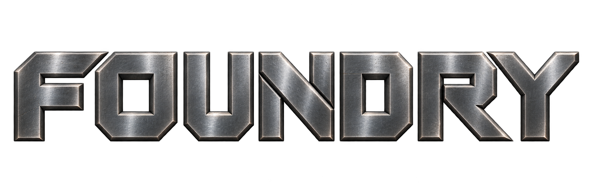

<p align="center">
  
</p>

A modular 2D-first game engine, written in Zig, built to grow into a general-purpose
2D/3D engine with modding as a first-class feature rather than an afterthought.

Foundry is a long-term, incremental engineering project. Every milestone is required to
leave behind something that runs.

## Status

**M0 through M15 complete.** Foundry is a playable, inspectable, fully moddable,
packageable and hardened 2D engine; it has a face of its own, and now an editor that
authors the content it runs.
Content packages are discovered and dependency-ordered; native C mods load through the
versioned public ABI and can add component types, systems and behaviour without engine source
changes; and **script mods run on the world's tick and can be edited while the game is
running**.

**M9 is complete: all eight steps are done.** Its
[eight-step plan](docs/design/distribution.md#14-implementation-order) covers preferences,
user package roots, release staging, attribution, diagnostics and macOS distribution. Step 1
adds bounded, versioned user preferences — the same field-block layout a record and a save
already use, written by creating a temporary file, syncing it and renaming it over the old
one, so a settings file is never half-written and one this build does not understand is kept
rather than replaced. Step 2 puts them to work: both samples take their window size and master
volume from a built-in fallback, then their package's own `config` record, then whatever the
player saved — so a mod can change a default and a player can overrule it. Step 3 discovers
explicitly selected packages from the platform user-data `mods/` directory beside the installed
ones, retaining each package's confined root through asset/script/native load and hot reload;
the installation no longer needs to be writable for mods. Step 4 stages a release: `zig build
dist` produces a tree holding the program, the packages it named, and exactly the files those
packages' records refer to — no authoring text, no uncompiled grids, no headers and no
compiler — with an inventory of every path, size and SHA-256. Step 5 puts the attribution in
it: `LICENSE`, `NOTICE`, and a `THIRD_PARTY_NOTICES.txt` generated from the entries in
`THIRD_PARTY_LICENSES/`, each reproduced whole. Step 6 keeps local evidence: a bounded log
per session under the application's own data directory, with a marker recording whether the
session closed — so a launch that fails leaves something a person can read and send, and the
next launch starts beside it rather than on top of it. Step 7 turns that release into a real
macOS `.app`, matching retained dSYM and permission-preserving zip, validates its plist and
Mach-O dependencies, and ad-hoc signs the local artifact. Public Developer ID signing,
notarization and Gatekeeper verification have a separate explicitly credentialed build target.
Step 8 proves the exported helpers from an external build, checksum-matched HTTP transfer,
runtime without Zig/Xcode on `PATH`, cross-process preferences, relocation/read-only user mods,
and failed-then-clean diagnostics; see the [macOS shipping guide](docs/shipping/macos.md).
ADR-0032 defers actual Developer ID signing, notarization and verification of the exact
quarantined download on a genuinely clean recipient Mac to the first public release. Those
remain mandatory; the current ad-hoc artifact is not equivalent to a notarized release.

**Phase 4 — Hardening and reach** is under way. M10 gave the engine its
[marks](brand/) and put its icon on the artifacts it builds; what follows is the carried
defects, the job system, a second graphics backend (Vulkan, [ADR-0033](docs/adr/0033-vulkan-second-backend.md)),
a mod manager, the editor, networking, and last of all the certified public release —
strangers come last. It gathers work the project had already deferred. See the
[roadmap](docs/ROADMAP.md).

**M11 is complete: all nine steps are done.** Its
[nine-step plan](docs/design/hardening.md#12-implementation-order) covers resource lifetime,
Metal test coverage, usage validation, frame/file errors, UI batching and diagnostic timing.
The final gate passed with the two real Metal sample windows inspected, an external font
override exercised, the Metal test graph and repeated in-flight texture replacement clean,
persisted diagnostics checked, and a strict-valid ad-hoc distribution retaining its icon.
The existing technical-debt record now distinguishes closed defects from deliberate limits.

**M12 is complete: Foundry uses more than one core.** Parallel work goes through an explicit
`core.Jobs` whose chunks are fixed by the data, so any worker count computes the same bytes.
With 50,000 sprites, nine workers made the sandbox's vertex writing about three times as fast
and its simulation steps about two and a half. See
[ADR-0036](docs/adr/0036-explicit-deterministic-jobs.md) and its
[design](docs/design/jobs-and-threading.md).

**M13 is complete: Foundry draws through Vulkan on Windows.** All
[ten steps](docs/design/vulkan.md) are done. Both samples run on an Intel Arc GPU from a
relocated install, under Vulkan's validation layers, and each wears a window icon it supplies.
A RenderDoc capture was inspected, frame pacing was measured, and real keyboard and mouse input
drove both samples through Windows. Metal stays macOS's backend. Linux is not part of M13
([ADR-0039](docs/adr/0039-linux-after-the-first-game.md)). The first game built on Foundry
targets macOS and Windows, so Linux runtime support follows that game and precedes any 3D
work.

**M14 is complete: players choose their mods.** All
[nine steps](docs/design/mod-management.md) are done. A player's selection is an ordered
profile in its own file, applied at the next start
([ADR-0040](docs/adr/0040-ordered-profiles-applied-at-next-start.md)). Settings migrate between
schema versions and keep the old file once. Two running copies of a game keep each other's
changes. The room has a mod screen modelled on Mod Organizer 2 (press M), showing load order,
per-record conflicts and pending changes. It is built only from the public `FoundryApi_v3`, and
drawn from a theme that is ordinary content
([ADR-0041](docs/adr/0041-game-widget-set-and-content-themes.md)), so a mod can re-skin it. The
exit proof passed on macOS and on Windows through Vulkan, in release builds driven by real
input. Both wrote the same files byte for byte, apart from the volume a slider click chose.

**M15 is complete: Foundry authors its own content, through its own public API.** All
[nine steps](docs/design/editor.md) are done. The parser can say where everything was
written and `data` can put a value back without disturbing the bytes around it, so an edit
splices one construct and leaves your comments, alignment and imports alone
([ADR-0043](docs/adr/0043-source-preserving-authoring-and-explicit-builds.md)). `author` at
L4 owns the one package compiler — `fpack` and the editor are both its clients, so they
cannot disagree — along with bounded revisioned typed commands, undo and redo, conflict-safe
per-file saves and retained isolated builds. All of it is published as the additive 47-call
`FoundryApi_v4`, and the editor is a **separate application built on that table and nothing
else**: its client is compiled against `foundry.h` alone, so it has no private path into the
engine ([I4](CLAUDE.md#3-invariants),
[ADR-0042](docs/adr/0042-authoring-through-the-public-api.md)). The exit proof authored a
content mod in an empty directory outside this repository entirely by clicking — manifest,
dependency, an override of the room's theme, a refused value corrected, undo, redo, save,
build, export — and the relocated room sample loaded it from its ordinary user `mods/`
directory and changed visibly. A C99 program does the same job through the same calls. It
ran on macOS/Metal and on Windows/Vulkan, and both wrote the same bytes.

**M16 is in progress; Steps 1–6 of nine are complete.** Its accepted
[networking design](docs/design/networking.md) requires public-internet multiplayer through an
operator-hosted authority with mutually authenticated TLS. Pinned Mbed TLS 3.6.7 LTS passed
the in-memory provider qualification, L2 `net` holds checked limits, runtime channels and
frozen FNET wire v1, and `platform` now carries authenticated streams: nonblocking TCP with
mandatory mutual TLS 1.3, a pinned server key and no plaintext path, proved over real loopback
on macOS and Windows. `net` now admits peers over them: sessions only by host grant, an
allowlist of client keys, compatibility compared before any application byte, and bounded
work, deadlines and budgets before and after authentication. An admitted peer is synchronized
by one acknowledged baseline, then sends commands the server admits in tick batches ordered by
participant, and receives the newest complete state. All of it is published as the additive
`FoundryApi_v5`, 22 calls over grants the host chooses to publish. No sample uses it yet; Step 6
connects the sandbox, and the real WAN proof remains an M16 exit gate.

All three modding tiers work — see [docs/modding](docs/modding/). Tier 2 is restricted
Lua 5.5.1, one VM per package, bounded in memory, instructions and engine calls, reaching the
engine only through the same public ABI table a native mod is handed. Replacing a package's
code builds a candidate VM beside the running one: the old state crosses, the entities it owns
stay, and source that does not compile leaves the last working version running with one warning
saying so. The author guide was written by building a script package outside this repository
and then rebuilt from its own listings to check that it says what the engine does.

```sh
./scripts/install-zig.sh   # the only tool you need
zig build run -Drhi=metal  # opens a window and draws; escape quits
zig build test             # 1460 headless tests
```

Implemented so far:

* **`core`** — allocators, generational handles, content IDs, math, fixed-timestep time, RNG.
* **`platform`** — window, input, filesystem, dynamic libraries, clocks. An SDL3 backend
  and a headless one, kept honest by a `comptime` conformance check.
* **`data`** — schemas and their runtime registry, the `.fdt` authoring format and its
  diagnostics, the `.fpk` runtime format, and the store that merges packages by load order.
* **`rhi`** — the render hardware interface, with Metal and Vulkan backends and a
  **validation backend** that enforces the strict rules Metal forgives. Not scaffolding: every
  rendering test runs against it headlessly, and when Vulkan arrived in M13 three of its rules
  were tightened and none relaxed.
* **`asset`** — Foundry's own PNG decoder, and the registry that turns a content ID into a
  loaded asset through loaders registered at runtime, including bounded/revisioned script
  source. Nothing is addressable by path.
* **`render2d`** — sprite and text batching, atlases, cameras.
* **`physics2d`** — shapes, tile grids, broadphase, collision queries and response.
* **`ui`** — an immediate-mode kernel that emits a renderer-independent draw list, a debug
  widget set, and a game widget set drawn from content themes.
* **`scene`** — runtime-registered components and systems, entities, queries and world saves.
* **`audio`** — Foundry's WAV decoder and lock-free mixer over the platform audio device.
* **`app`** — the engine loop, subsystem lifecycle, the log sink, loading content packages in
  the order it is given them, and the mod set: a player's ordered profiles, conflicts between
  packages, and versioned settings that migrate.
* **`author`** — the content compiler, at L4 beside `app`: a package directory read as text
  and compiled to one `.fpk`, the dependency packages a host grants it, and bounded source
  workspaces. `fpack` and, in M15, the editor are its hosts.
* **`debug`** — the in-process profiler, memory report, log console, entity inspector and
  content browser.
* **`mod`** — manifests, package discovery, dependency resolution and deterministic order.
* **`script`** — an optional restricted Lua runtime with protected execution, heap and
  instruction quotas, the bounded `foundry` binding a script calls the engine through, the
  package lifecycle that registers one system per script package and drives it on a fixed tick,
  and the candidate-VM transaction that replaces a package's code while its state, its entities
  and the world stay.
* **`abi`** — the installed C99/C++ header, frozen 135-call `FoundryApi_v1`, additive
  `FoundryApi_v2` and `FoundryApi_v3`, host boundary and native-library lifecycle.
* **`tools/fpack`** — the content compiler's command line: a package directory in, one `.fpk`
  out, checked against the `--dependency` packages it is named.
* **`content/core`** — package zero. The engine's own content, loaded through exactly the
  path a mod's package uses, because that is the only durable way to know that path works.

[PROJECT_STATE.md](PROJECT_STATE.md) records exactly where things stand, and is updated
every session.

This is currently a solo project in an early stage. It is developed in the open because the
boundaries are worth making checkable. The versioned public C ABI now exists, but Foundry is
not yet a shipped release and interfaces outside that ABI remain free to evolve.

## Scope

This repository is the engine, its tools, its samples and its documentation. **Games live in
their own repositories** and consume Foundry as a dependency, with their licensing and content
decided independently ([ADR-0017](docs/adr/0017-repository-scope.md)).

`samples/` holds the smallest thing that exercises a capability. A sample is not a game.

## Documents

| File | Purpose | Changes |
| --- | --- | --- |
| [CLAUDE.md](CLAUDE.md) | Durable philosophy, invariants, architecture, conventions | Rarely |
| [PROJECT_STATE.md](PROJECT_STATE.md) | Current phase, what works, next steps, open questions | Every session |
| [docs/ROADMAP.md](docs/ROADMAP.md) | Staged milestones from minimal engine to 2D to 3D | Occasionally |
| [docs/adr/](docs/adr/) | Numbered architecture decision records | Append-only |
| [docs/design/](docs/design/) | Per-subsystem design, written before implementation | As needed |
| [docs/shipping/macos.md](docs/shipping/macos.md) | macOS packaging, recipient use and public-release gates | At release-boundary changes |
| [brand/](brand/) | The marks, and what anyone may do with them | Rarely |

If you read only one thing, read `CLAUDE.md` §3 — the nine invariants. They are the
constraints everything else follows from, and most of them exist to keep modding possible.

## Target platforms

| Platform | Role | Graphics |
| --- | --- | --- |
| macOS on Apple Silicon | Primary development target, first-class supported | Metal (native) |
| Windows x64 | Second target, runtime-tested in M13 | Vulkan |
| Linux x64 | Intended target; runtime support after the first game, before 3D | Vulkan, compile-checked only |

Windows and Linux are cross-compiled as a portability check each milestone. Windows also runs,
on one tested Intel Arc machine so far; Linux is not yet tested at runtime. See
[ADR-0008](docs/adr/0008-target-platforms.md) and
[ADR-0039](docs/adr/0039-linux-after-the-first-game.md).

## Toolchain

**The only tool you need to install is Zig**, pinned to a specific stable release. No CMake,
no Ninja, no Make, no pkg-config — Zig's build system compiles C, C++ and Objective-C,
cross-compiles, fetches dependencies with pinned hashes, runs tests and hosts custom build
steps ([ADR-0014](docs/adr/0014-toolchain.md)). On macOS, Xcode supplies the rest: the Metal
framework, the Objective-C compiler, `xcrun metal` for shaders, and GPU frame capture.

```sh
./scripts/install-zig.sh
```

That fetches the pinned release from ziglang.org, verifies its SHA256, installs it to a
versioned path, and symlinks `zig` into `~/.local/bin` — deliberately not a package-manager
install, so an unrelated upgrade cannot move the compiler. The pinned version is in
[.zigversion](.zigversion). Upgrading is an explicit act, made between milestones.

## License

Apache-2.0 — see [LICENSE](LICENSE) and [NOTICE](NOTICE). Third-party dependencies and their
licenses are recorded in [THIRD_PARTY_LICENSES/](THIRD_PARTY_LICENSES/), where a dependency and
its license entry are required to land in the same commit.
